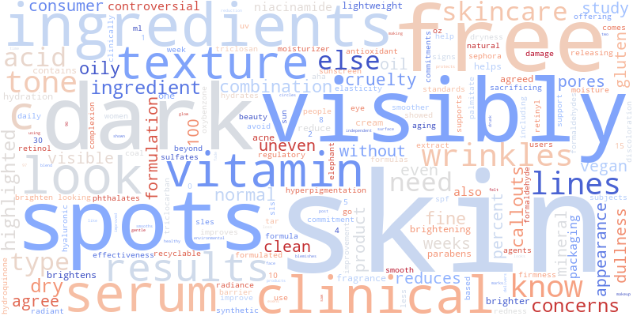
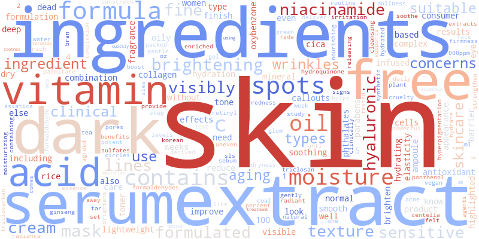

# **Hype vs. Hyperpigmentation** 
By Vyomi Seth, Shamita Goyal, Tanvi Vidyala, and Sarah Sun

## Abstract 🔍
This study looks at the differences in marketing strategies and consumer perceptions of hyperpigmentation treatments in Asian and Western skincare markets. Using exploratory data analysis (EDA), machine learning classification, and hypothesis testing, we analyzed ingredient emphasis, pricing structures, and linguistic framing in product descriptions from both regions. Our findings reveal that Asian skincare brands prioritize gentle, long-term skincare benefits, often highlighting ingredients like Niacinamide and Tranexamic Acid, whereas Western brands focus on clinical efficacy and faster results, emphasizing Vitamin C and Alpha Arbutin. Price analysis showed that Western skincare products tend to be more expensive, likely due to branding and positioning, while Asian brands offer more accessible pricing. A Random Forest model achieved 95.31% accuracy in distinguishing between Asian and Western skincare products, showing the significant difference in marketing language, pricing, and ingredients. Additionally, hypothesis testing confirmed a statistically significant difference (p < 0.05) in the words used to market products, with Western brands focusing on “dark spots” and “visible results” while Asian brands emphasized “moisture” and “radiance.” 

## Research Question 🤔
How do Asian and Western skincare brands differ in their use of ingredients, product descriptions, and pricing for hyperpigmentation treatments? Specifically, how do they market five key brightening ingredients (Vitamin C, Niacinamide, Alpha Arbutin, Kojic Acid, and Tranexamic Acid), and what patterns emerge in their pricing and language? Additionally, can we build a predictive model that classifies skincare products as either Asian or Western based on these factors?

## Background and Prior Work 📚
### 1.1 Intro to Hyperpigmentation
Hyperpigmentation occurs when skin cells produce excess melanin, the pigment responsible for skin and hair color. Various factors contribute to this condition, including sun exposure, genetics, hormonal changes (such as pregnancy), and certain medications like antibiotics or oral contraceptives. External influences, including exposure to heavy metals (iron, arsenic, lead), tobacco smoke, and medical conditions such as diabetes, thyroid disorders, and adrenal insufficiency (Addison’s disease), can also trigger or worsen hyperpigmentation. Skin injuries, inflammation, and dermatological conditions like acne and atopic dermatitis may further contribute to dark spots.[1](#ref1)

### 1.2 Types of Hyperpigmentation
Several types of hyperpigmentation exist, each with different causes. Freckles darken with sun exposure, age spots develop due to prolonged UV exposure, and melasma appears as dark patches influenced by hormones. Other types, like post-inflammatory hyperpigmentation, result from skin trauma, while acanthosis nigricans is linked to insulin resistance.[1](#ref1) In this project, we will examine hyperpigmentation as a whole rather than focusing on specific types.

### 1.3 Five Main Active Ingredients to Target Hyperpigmentation
Various active ingredients are used in skincare products to target hyperpigmentation, with five of the most prominent being Vitamin C, Niacinamide, Alpha Arbutin, Kojic Acid, and Tranexamic Acid. We will be analyzing and looking out for these ingredients as a key factor in our analysis. 

- **Vitamin C** is a powerful antioxidant that helps protect the skin from UV-induced damage, a common trigger for melasma. It also brightens the skin by inhibiting melanin production and works even more effectively when combined with other skin-lightening ingredients.[2](#ref2)
- **Niacinamide**, a form of Vitamin B3, is a well-tolerated ingredient known for its skin-brightening and anti-inflammatory properties. It helps regulate melanosome transfer, leading to a more even skin tone while also promoting hydration and strengthening the skin barrier, making it suitable for various skin types. [2](#ref2)
- **Alpha arbutin**, a naturally derived antioxidant and skin brightener from the bearberry plant, is a gentler alternative to hydroquinone for reducing hyperpigmentation. [3](#ref3)
- **Kojic acid**, derived from fermented rice, functions as a tyrosinase inhibitor, reducing melanin production and helping to fade dark patches associated with melasma. [2](#ref2)
- **Tranexamic acid**, which can be used orally or topically, further aids in melasma treatment by inhibiting melanocyte activation while also offering anti-inflammatory and anti-angiogenic benefits, making it a valuable addition to a comprehensive pigmentation treatment plan. [2](#ref2)

### 1.4 Asian vs Western Markets in Skincare
Asian and Western skincare markets operate under distinct cultural and consumer-driven dynamics that shape their marketing strategies. In Asia, skincare is deeply rooted in tradition, with an emphasis on holistic beauty and multi-step routines that prioritize prevention and long-term skin health. This is reflected in marketing approaches that highlight heritage, ingredient efficacy, and time-honored rituals. On the other hand, Western skincare consumers value individuality, simplicity, and innovation, leading to marketing strategies that focus on product differentiation, minimalistic formulations, and ethical considerations such as sustainability and cruelty-free certifications. Marketing language reflects these differences, with Asian brands highlighting “radiance” and “brightening,” while Western brands use terms like “even skin tone” and “dark spot corrector” to emphasize clinical efficacy.[4](#ref4)  

### 1.5 Previous Studies
Looking at previous projects, we found that many focus on comparing skincare products across markets, analyzing Sephora reviews, ingredient effectiveness, and consumer sentiment. Some studies examine brightening ingredients like Kojic Acid and Vitamin C in Korean treatments, while others explore marketing claims versus user experiences in Western beauty brands.

- The Kaggle project "Skincare Products EDA & Sentiment Analysis" by Melissa Monfared explores Sephora’s skincare products using exploratory data analysis (EDA) and sentiment analysis on over 1 million customer reviews. It examines brand popularity, pricing trends, and ingredient usage, along with consumer sentiment toward different products. By applying natural language processing (NLP), the project classifies reviews as positive, neutral, or negative, revealing key themes in customer feedback. This analysis provides insights into consumer preferences and satisfaction, which can be extended to compare marketing claims vs. actual user experiences, particularly for hyperpigmentation treatments in different beauty markets.[5](#ref5)  
- The Horizon grand review research website provides a detailed analysis of the hyperpigmentation treatment market in South Korea, presenting key statistics and growth projections. It highlights that the market was valued at USD 16.6 million in 2023 and is expected to reach USD 29.2 million by 2030, growing at a CAGR of 8.5%. The website includes graphs and data visualizations to illustrate trends, such as the dominance of age spots as the largest segment and melasma as the fastest-growing indication. Additionally, it compares South Korea’s market performance to other global and regional markets, showcasing insights into the broader hyperpigmentation treatment industry.[6](#ref6)
- This journal article focuses on key ingredients for hyperpigmentation treatment, specifically niacinamide and tranexamic acid (TXA), as previously discussed. A randomized, double-blind, vehicle-controlled study evaluated the effectiveness of a topical formulation containing 2% niacinamide and 2% TXA in reducing facial hyperpigmentation. Niacinamide, a vitamin B3 derivative, inhibits melanosome transfer from melanocytes to keratinocytes, while TXA prevents UV-induced pigmentation by decreasing melanocyte tyrosinase activity. The 8-week study, conducted on 42 Korean women, found that the niacinamide + TXA formulation significantly (P < 0.05) reduced pigmentation compared to a control group. These findings highlight the potential of this combination as an effective alternative to hydroquinone-based treatments for improving skin tone and addressing irregular pigmentation.[7](#ref7)

### Summary
Collectively, these studies suggest that marketing language, consumer expectations, and review patterns are deeply influenced by cultural perceptions of beauty, shaping how hyperpigmentation treatments are promoted and evaluated in different markets.

---

## References  

**[1]** *Demystifying Hyperpigmentation: Causes, Types, and Effective Treatments.* Harvard Health Publishing. [https://www.health.harvard.edu/diseases-and-conditions/demystifying-hyperpigmentation-causes-types-and-effective-treatments](https://www.health.harvard.edu/diseases-and-conditions/demystifying-hyperpigmentation-causes-types-and-effective-treatments) [↩](#ref1)

**[2]** *Best Ingredients for Hyperpigmentation.* Miiskin. [https://miiskin.com/anti-aging-beauty/best-ingredients-for-hyperpigmentation/](https://miiskin.com/anti-aging-beauty/best-ingredients-for-hyperpigmentation/) [↩](#ref2)

**[3]** *Everything You Need to Know About Alpha Arbutin.* Naturium. [https://naturium.com/blogs/the-lab-journal/everything-you-need-to-know-about-alpha-arbutin#:~:text=What%20is%20Alpha%20Arbutin%3F,%2C%20and%20post%2Dinflammatory%20pigmentation](https://naturium.com/blogs/the-lab-journal/everything-you-need-to-know-about-alpha-arbutin#:~:text=What%20is%20Alpha%20Arbutin%3F,%2C%20and%20post%2Dinflammatory%20pigmentation) [↩](#ref3)

**[4]** *East Meets West: How Asian Brands Can Appeal to Western Audiences.* Kadence. [https://kadence.com/en-us/east-meets-west-how-asian-brands-can-appeal-to-western-audiences/#:~:text=For%20instance%2C%20in%20the%20beauty,with%20a%20legacy%20of%20trust](https://kadence.com/en-us/east-meets-west-how-asian-brands-can-appeal-to-western-audiences/#:~:text=For%20instance%2C%20in%20the%20beauty,with%20a%20legacy%20of%20trust) [↩](#ref4)

**[5]** *Skincare Products EDA & Sentiment Analysis.* Kaggle. [https://www.kaggle.com/code/melissamonfared/skincare-products-eda-sentiment-analysis](https://www.kaggle.com/code/melissamonfared/skincare-products-eda-sentiment-analysis) [↩](#ref5)

**[6]** *Hyperpigmentation Treatment Market – South Korea.* Grand View Research. [https://www.grandviewresearch.com/horizon/outlook/hyperpigmentation-treatment-market/south-korea](https://www.grandviewresearch.com/horizon/outlook/hyperpigmentation-treatment-market/south-korea) [↩](#ref6)

**[7]** *Advances in Hyperpigmentation Treatment: A Review.* Wiley Online Library. [https://onlinelibrary.wiley.com/doi/full/10.1111/srt.12107](https://onlinelibrary.wiley.com/doi/full/10.1111/srt.12107) [↩](#ref7)

## Hypothesis 💭
We predict that Asian skincare markets are more likely to market hyperpigmentation treatments with terms like “whitening” and “brightening,” as well as prioritize gradual improvement whereas Western markets will market hyperpigmentation with terms like “dark spot correction” and “even skin tone” while prioritizing clinical efficiency and fast results.

We believe this is the case due to cultural differences and differences in beauty norms between Asian countries and Western countries, with a study by Columbia University showing that skin lightening products were used at higher rates by Asian women born outside of the United States than any other demographic assessed. [8](#ref8)

---

### References  
**[8]** *Impact of Environmental Factors on Skin Hyperpigmentation.* Liebert Publishing. [https://www.liebertpub.com/doi/10.1089/env.2022.0053](https://www.liebertpub.com/doi/10.1089/env.2022.0053) [↩](#ref8)

## Data Collection 📊
### Data Overview

- Dataset #1
  - Dataset Name: Sephora
  - Link to the dataset: Webscraped from the [Sephora website](https://www.sephora.com/shop/dark-spot-remover)
  - Saved as: data/original_sephora_dataset.csv
  - Number of observations: 219
  - Number of variables: 6

This dataset consists of **219** skincare products from the Sephora website, listing their brand, name, price, product description, ingredients list, and review count. This data was scraped from their list of skin care products, filtered by choosing the 'dark spots' concern under the 'Shop by concern' dropdown.
  
- Dataset #2
  - Dataset Name: YesStyle
  - Link to the dataset: Webscraped from the [YesStyle website](https://www.yesstyle.com/en/beauty-skincare/list.html/bcc.15544_bpt.46#/s=10&l=1&bt=37&pn=1&bpt=46&bcc=15544&sb=136&t=10)
  - Saved as: data/original_yesstyle_dataset.csv
  - Number of observations: 202
  - Number of variables: 7

The dataset consists of **202** skincare products from the Sephora website, listing their brand, name, price, product description, ingredients list, review rating (1-5) and review count. This data was scraped from the skin care product category, filtered for products that were tagged as being for 'hyperpigmentation.'

#### Webscraping
For both datasets, we collected the data by running the [Easy Scraper](https://chromewebstore.google.com/detail/easy-scraper-one-click-we/cljbfnedccphacfneigoegkiieckjndh?pli=1) web extension for Chrome. After getting a list of product links from the store page using the scraper, we could then input that list of links into the extension and select which information we wanted to get from each product page. After that, it was a matter of letting the scraper run on the computer. We may have been able to collect a longer list of products if so desired by letting the webscraper run for a signficantly longer time. Each scraped dataset was saved as a .csv file.

#### Variables
The qualitative variables such as brand and product name are unique to each product and serve as indentifiers. The key metric variables—price (continuous) and rating (ordinal)—will act as proxies for product accessibility and consumer satisfaction. Since ingredients are stored as long text strings, preprocessing would involve tokenization and named entity recognition to extract and analyze the presence of brightening ingredients. Data cleaning will require handling missing values, standardizing brand names, and converting ratings and prices into normalized ranges for comparing across markets. Another step of preprocessing is adding a column with the product's country of origin, in order to deduce location-based differences in the product.

### 1) Dataset #1: Sephora
Our webscraped results from the Sephora website were saved in the **original_sephora_dataset.csv** file. The dataset contained 219 rows and 6 columns.

#### 1.1 Data Annotation 
In order to compare products from Western vs. Asian countries we must label each product with its country of origin. This wasn't a detail included on the Sephora website, making scraping it difficult. Instead, to do this we utilized the OpenAI API for quick labeling, and fix any errors we may find. 

##### Quality Control for OpenAI API
We manually checked a random sample (10% of the total dataset) of products to determine that the API has accurately labeled a majority of our products with its country of origin. 

We found OpenAI's labeling to be **accurate** after sampling 21 products and manually checking them to find that all of them were labeled with the correct country of origin.
- Kiehl's Since 1851 – United States ✅
- OLEHENRIKSEN – Denmark ✅ 
- iNNBEAUTY PROJECT – United States ✅ 
- Sulwhasoo – South Korea ✅
- HUDA BEAUTY – United Arab Emirates ✅ 
- Estée Lauder – United States ✅ 
- Fenty Beauty by Rihanna – United States ✅ 
- Glow Recipe – United States ✅ 
- RANAVAT – United States ✅ 
- Westman Atelier – United States ✅ 
- Caudalie – France ✅ 
- Shiseido – Japan ✅ 
- Dr. Idriss – United States ✅ 
- ALPYN – United States ✅

#### 1.2 Data Cleaning for Sephora

Now, we need to clean our data to make the analysis process easier. First, we need to remove all dollar signs from the price_usd column and convert the values to the same data type. Second, we need to convert the review_count column into floats and remove the "K" to represent values in thousands. Third, we need to extract the keyword "water" from the ingredients column to keep the data non-repetitive and consistent. Fourth, we need to filter out unnecessary symbols and incorrect formatting to make ingredient data more uniform and structured in the **product_description** column. Lastly, we need to remove line breaks from the product_description column.

This code defines three functions to clean and convert data in a sephora_skincare DataFrame:

1. **price_to_float()** removes dollar signs and converts price strings to floats, returning NaN if conversion fails.
2. **review_count_to_float()** converts review counts from strings to floats, handling 'K' as thousands.
3. **ingredients_only()** extracts the first ingredient containing "Water" from the ingredient list, ignoring "Watermelon".
4. **strip_description()** removes line breaks from product description.
5. **ingredient_seperation()** cleans and standardizes a skincare ingredient list by converting text to lowercase, removing special characters, and ensuring consistency in ingredient names 

These functions were applied to the respective columns of the sephora_skincare DataFrame using .apply().

| brand_name    | product_name                                             | price_usd | product_description                                         | ingredients                                                | review_count | country     |
|---------------|-----------------------------------------------------------|-----------|---------------------------------------------------------------|-------------------------------------------------------------|--------------|-------------|
| The Ordinary  | Glycolic Acid 7% Exfoliating Toner                        | 13.0      | What it is: A daily surface exfoliator that sm...            | ['water', ' glycolic acid', 'water', 'water', ...]          | 4000.0       | Canada      |
| Caudalie      | Vinoperfect Brightening Dark Spot Serum Vitami...         | 82.0      | What it is: A brightening serum that combats t...            | ['water', ' butylene glycol', ' glycerin', ' c...']          | 3500.0       | France      |
| The Ordinary  | The Resurface & Hydrate Set with Hyaluronic Ac...         | 10.0      | What it is: A set of two mini serums: one with...            | ['glycolic acid', 'water', 'water', ' sodium h...']          | 107.0        | Canada      |
| The Ordinary  | Azelaic Acid 10% Suspension Brightening Cream             | 12.2      | What it is: A multifunctional cream that visib...            | ['water', ' isodecyl neopentanoate', ' dimethi...']          | 1300.0       | Canada      |
| innisfree     | Green Tea Enzyme Vitamin C Brightening + Exfol...         | 28.0      | What it is: A set of daily toner pads with vit...            | ['water', ' butylene glycol', ' glycerin', ' n...']          | 169.0        | South Korea |

### 2) Dataset #2: YesStyle

Data that we scraped from the YesStyle website was stored in the **original_yesstyle.csv** file. The dataset had 202 rows and 7 columns. While missing values also occured in this dataset, most of the information per row should be left intact, and can be used for different analyses, so we will not remove rows with missing values.

#### 2.1 Data Cleaning for YesStyle 

Now, we need to clean our YesStyle dataset. First, we need to remove non-numeric characters and ensure the **price_usd** column has a consistent data type. Second, we need to extract the product name specifically from the **product_name** column. Third, we need to clean and standardize a skincare ingredient list by converting text to lowercase, removing special characters, and ensuring consistency in ingredient names in the **ingredients** column. Lastly, we need to process the **review_count** column by converting all values to floats to maintain consistency with the rest of the data.

1. **price_to_float()** removes non-numeric characters and converts the price to a float.
2. **product_name_without_brand()** extracts the product name by removing the brand part.
3. **yesstyle_review_count_to_float()** handles review counts, removing commas and converting them to floats.
4. **ingredient_seperation()** converts ingredient lists from strings to cleaned lists

These functions are applied to the respective columns in the yesstyle_skincare DataFrame.

#### 2.2 Removing duplicates/overlaps and approval_rating column

Since we won't be using the **approval_rating** column in our analysis, we removed it. Similarly, we will remove any duplicate values and set all the countries in the country column to South Korea because all the skincare products filtered were from the South Korea category.

| brand_name    | product_name                                               | price_usd | product_description                                         | ingredients                                                | review_count | country     |
|---------------|-------------------------------------------------------------|-----------|---------------------------------------------------------------|-------------------------------------------------------------|--------------|-------------|
| Dr. Althea    | 345 Relief Cream                                            | 24.30     | Shield your skin from environmental damage wit...            | [water, propanediol, glycerin, cyclohexasil...]            | 4226.0       | South Korea |
| APLB          | Glutathione Niacinamide Sheet Mask                          | 0.99      | Perk up dull skin instantly with this sheet ma...            | [water, centella asiatica extract (135%), bu...]           | 2979.0       | South Korea |
| Anua          | Niacinamide 10 TXA 4 Serum                                  | 15.20     | Tackle hyperpigmentation with this serum formu...            | [water, glycerin, niacinamide, tranexamic a...]            | 5543.0       | South Korea |
| SKIN 1004     | Madagascar Centella Tone Brightening Capsule A...           | 16.61     | Improve dull and tired skin with this lightwei...            | [water, butylene glycol, niacinamide, glyce...]            | 5883.0       | South Korea |
| medicube      | PDRN Pink Collagen Gel Mask                                 | 4.50      | Collagen gel mask packed with elasticity-boost...            | [water, glycerin, methylpropanediol, acryla...]            | 262.0        | South Korea |

### 3) Splitting Collected Datasets into Asian Beauty and Western Skincare 

Since both datasets represent different countries, we categorized them into seperate Western skincare and Asian skincare datasets to gain a better understanding of how these two cultures may differ. Here is the breakdown of the different countries incorporated.

| Country               | Count |
|-----------------------|-------|
| United States         | 138   |
| South Korea           | 127   |
| France                | 15    |
| United Kingdom        | 15    |
| Canada                | 8     |
| Japan                 | 8     |
| Denmark               | 4     |
| Germany               | 3     |
| Spain                 | 2     |
| United Arab Emirates  | 1     |
| USA                   | 1     |
| India                 | 1     |
| Australia             | 1     |

## Results 📝

### 4) Exploratory Data Analysis

#### 4.1 Comparing Most Common Ingredients Across Western and Asian Datasets

We wanted to compare general ingredient differences and how often key brightening ingredients— **Vitamin C**, **Niacinamide**, **Alpha Arbutin**, **Kojic Acid**, and **Tranexamic Acid**—appear in product descriptions from American and Korean skincare brands. To do this, we searched for ingredient mentions in the dataset and counted their frequency. This allows us to determine whether American or Korean skincare brands emphasize different ingredients in their marketing. We visualized the ingredient mentions using bar charts, making it easier to see which ingredients are most popular in each region.

<iframe
  src="asian_ingredients_top20.html"
  width="1000"
  height="600"
  frameborder="0"
></iframe>

<iframe
  src="western_ingredients_top20.html"
  width="1000"
  height="600"
  frameborder="0"
></iframe>

Water is the most common ingredient in both datasets, which makes sense since it is a common base for liquid products. At first glance, we can see that there are some differences in the ingredients and order in each top twenty list, but it's hard to compare across lists since some ingredients may have similar frequencies in each dataset, but may be at a different rank. We can notice that one of our targeted ingredients, niacnamide, makes the top 20 list in both Asian and Western datasets (rank 6 and 17, respectively). However, it would not make sense to conclude anything with just the ingredient lists and not much knowledge of the function of each ingredient, since the proportion of product types (serum, cleanser, moisturizer, etc.) may be significantly different between our two datasets, and skew the frequencies of some of these general ingredients.

<iframe
  src="ingredient_mentions_density.html"
  width="1000"
  height="600"
  frameborder="0"
></iframe>

From the results, **Niacinamide** stood out as the most frequently mentioned ingredient in Asian products, but it appeared slightly more often in Western marketing. This suggests that **Niacinamide is a popular ingredient in product formulations and marketing in both regions**.

**Vitamin C**, a popular brightening ingredient, was the most mentioned ingredient in Western products, with a significantly higher proportion of mentions in Western skincare products than Asian products. Vitamin C was the second most mentioned ingredient in the descriptions of Asian products.

**Alpha Arbutin and Kojic Acid**, which are also well-known for their skin-brightening properties, were almost **nonexistent in Korean skincare**. American brands mentioned Alpha Arbutin once and Kojic Acid **five times**, while neither ingredient appeared at all in Korean product descriptions. This suggests that these two ingredients might be more commonly used or marketed in the American skincare industry.

Overall, the biggest takeaway is that **Niacinamide and Vitamin C are the most dominant brightening ingredient in both American and Korean skincare**, but **Western brands emphasize Vitamin C even more**. Meanwhile, ingredients like Alpha Arbutin and Kojic Acid seem to be much more prominent in American skincare, while Tranexamic Acid is emerging as a globally recognized ingredient. This analysis helps highlight how ingredient preferences and marketing strategies differ between the two skincare markets.

#### 4.2 Price Distribution: American vs. Korean Skincare

We wanted to compare the price distributions of American and Korean skincare products to determine whether there were significant differences in pricing strategies between the two markets. We visualized the distribution of prices using KDE and box plots, which allows us to identify the most common price ranges and determine whether one market tends to be more expensive than the other. If we find that one market consistently offers lower or higher prices, this could reflect differences in product positioning, ingredient sourcing, or branding.

<iframe
  src="kde_prices.html"
  width="1000"
  height="600"
  frameborder="0"
></iframe>

The KDE plot of skincare product prices reveals that Asian skincare products are generally more affordable, with most prices concentrated in the lower range. In contrast, Western skincare products have a wider price distribution, including a significant number of higher-priced items. This suggests differences in pricing strategies, ingredient sourcing, and brand positioning between the two markets.

<iframe
  src="price_boxplot_region.html"
  width="1000"
  height="600"
  frameborder="0"
></iframe>

The boxplot shows a similar story, but directly highlights outliers. Western skincare products exhibit a wider price range, with many outliers extending beyond $300. Asian skincare products are more affordable, with prices clustering at lower values and fewer extreme outliers. The interquartile range (IQR) for Western products is significantly larger, suggesting greater price variability.

While there's a huge range of prices in both categories, it looks like western products are more expensive on average. Let's check out some of the outliers.

**Western Skincare Outliers**

| brand_name         | product_name                                      | price_usd | product_description                                       | ingredients                                            | review_count | country         |
|--------------------|---------------------------------------------------|-----------|-------------------------------------------------------------|---------------------------------------------------------|--------------|------------------|
| Element Eight      | O2 Niacinamide Eight Active Multitasking Serum    | 325.0     | What it is: A multitasking serum with liquid o...           | []                                                      | 237.0        | United Kingdom   |
| Westman Atelier    | Suprême C 100% Vitamin C Brightening Serum        | 325.0     | What it is: An ultra-concentrated vitamin C ge...          | []                                                      | 4.0          | United States    |
| Dr. Barbara Sturm  | Brightening Serum                                 | 320.0     | What it is: A brightening serum that instantly...          | [water, methylsilanol mannuronate, glycerin,...]        | 9.0          | Germany          |
| La Mer             | The Eye Concentrate Cream                         | 275.0     | What it is: A lightweight, richly moisturizing...          | [algae extract, water, dimethicone, isododec...]        | 493.0        | United States    |
| Dr. Barbara Sturm  | Brightening Face Cream                            | 240.0     | What it is: A moisturizer that helps even out ...          | [water, glycerin, coco-caprylate, methylpro...]         | 5.0          | Germany          |

**Asian Skincare Outliers**

| brand_name | product_name                                         | price_usd | product_description                                       | ingredients                                            | review_count | country |
|------------|--------------------------------------------------------|-----------|-------------------------------------------------------------|---------------------------------------------------------|--------------|---------|
| SK-II      | GenOptics Ultraura Essence Serum                       | 265.0     | What it is: A potent serum that targets discol...           | [water, galactomyces ferment filtrate, butyl...]        | 166.0        | Japan   |
| Shiseido   | Vital Perfection Uplifting and Firming Advance...      | 140.0     | What it is: A daily moisturizer delivers multi...           | [water, butylene glycol, glycerin, triethyl...]         | 173.0        | Japan   |
| RANAVAT    | Radiant Rani- Saffron Brightening Dark Spot Tr...      | 135.0     | What it is: A saffron-infused super serum clin...           | [sesamum indicum (sesame) seed oil, oryza sat...]       | 353.0        | India   |
| SK-II      | PITERA™ Youth Essentials Kit                           | 110.0     | What it is: The complete PITERA™ minimalist 3-...          | [water, sodium lauroyl glutamate, propylene ...]        | 167.0        | Japan   |
| SK-II      | Aging Skin Facial Treatment Essence with Antio...      | 99.0      | What it is: A powerful essence that addresses ...           | [galactomyces ferment filtrate (pitera™), but...]       | 3300.0       | Japan   |

The presence of these high-priced outliers suggests that Western skincare markets accommodate a wider price spectrum, with luxury brands significantly driving up price variation. In contrast, Asian skincare brands remain mostly affordable, with only a few exceptions (e.g., SK-II). This supports the trend that Western brands often prioritize premium positioning, while Asian skincare emphasizes cost-effective, innovative formulations for broader accessibility.

The sites we chose to scrape from could have an impact on this, since Sephora and YesStyle, which primarily carry western and east asian skincare respectively, have different target audiences. Notably, YesStyle is self-marketed as a 'go-to destination for for inexpensive cosmetics' whose target audience is also consumers outside of East Asia.

#### 4.3 Word Frequency in Marketing Language
To understand how brands market their products, we analyzed the most frequently used words in product descriptions. This allows us to identify differences in marketing language between Western and Asian skincare brands. For example, do Western brands focus on **"science-backed" claims**", while Asian brands highlight **"hydration and radiance"**"? 

##### Visualizing With Bar Charts
To do this, we tokenized the product descriptions, counted word occurrences, and visualized the results using bar charts. When you hover on the barcharts you should see both the individual counts of each word, as well as the percent of the overall word count it takes up. You can also use the slider to adjust the number of top words displayed.

<iframe
  src="asian_top_marketing_words_10.html"
  width="1000"
  height="600"
  frameborder="0"
></iframe>

<iframe
  src="western_top_marketing_words_10.html"
  width="1000"
  height="600"
  frameborder="0"
></iframe>

##### Visualizing With Word Clouds
The word cloud visualization shows clear differences between how Western companies and Asian companies describe their products. 

**Western Skincare Word Cloud**

Western companies focus on results, using words like "skin" (0.04), "dark" (449), "visibly" (411), and "spots" (399). It also highlights anti-aging with words like "wrinkles" (214) and "lines" (215). Words like "clinical" (279) and "ingredient" (208) suggest a science-backed approach. Western company descriptions seem to focus on solving problems and showing visible changes.

**Asian Skincare Word Cloud**

Asian companies, on the other hand, focus more on ingredients and skin type suitability. Words like "extract" (85), "formula" (56), "moisture" (38), and "sensitive" (37) suggest a focus on gentle and hydrating products. The presence of "hyaluronic" (30) and "niacinamide" (32) shows an emphasis on specific ingredients. 

Unlike Western Companies, Asian companies do not use words that promise big results. Instead, it describes what the product contains and who it is for. This suggests that Western companies sell skincare with a focus on transformation, while Asian companies highlight safe and nourishing formulas.

## Further Analysis
### 5) Hypothesis Testing: Analyzing Word Usage Differences in Skincare Descriptions 🧪

In this section, we’re taking a closer look at whether the words used in Western and Asian skincare product descriptions are actually different or if the variation is just random. To do this, We perform a Chi-Square Test of Independence to determine whether there is a significant difference in word usage between Western and Asian skincare descriptions. This will help us understand whether the text features in our model really play a role in distinguishing between Western and Asian skincare products. 

To preprocess our data we used `CountVectorizer` to transform the text descriptions into a numerical representation and the `fit_transform()` method to process the descriptions, converting them into an array.

**Chi-Square Statistic**: 3475.6015381393863
**P-Value**: 0.0
The difference in word usage is statistically significant.

Since the p-value is effectively zero, we conclude that the **difference in word usage between Western and Asian skincare descriptions is statistically significant**.

Some key takeways:
- This means that Western and Asian skincare brands describe their products differently, using distinct vocabulary patterns.
- Further analysis like examining specific words contributing to this difference would provide insights into how these descriptions differ.
- Possible reasons for these differences perhaps could include cultural preferences, marketing strategies, ingredient focus, or consumer expectations in each region.

### 6) Classification Model for Asian vs. Western Skincare 🤖

Since there seems to be a significant difference between regions, we will now use the data we've collected to build a classification model that predicts whether a skincare product is from an Asian or Western brand based on its ingredients, product description, and price. By training the model on these features, we aim to identify key differences between the two markets and assess how well machine learning can distinguish them. 

Before fitting the Random Forest Classification model, we converted the cleaned text data into numerical features using TF-IDF (Term Frequency-Inverse Document Frequency). This transformation helps highlight important words that define skincare products while reducing the impact of common words that appear frequently in both categories. We also applied standardization to ensure that the price_usd feature has a consistent scale, preventing models from being biased by large numerical differences. Lastly, to create the final dataset for training, we combined the TF-IDF text features with the normalized price data. The labels are also converted into binary format, where Western products are labeled as 0 and Asian products as 1. 

Then we assessed the model. These metrics help us understand how well the model differentiates between Western and Asian skincare products. High accuracy and strong classification scores show that marketing language, ingredient choices, and pricing contribute to regional differences in skincare branding. 

**Accuracy:** 0.953125  

| Class     | Precision | Recall | F1-Score | Support |
|-----------|-----------|--------|----------|---------|
| Western   | 0.93      | 1.00   | 0.96     | 37      |
| Asian     | 1.00      | 0.89   | 0.94     | 27      |

**Overall Accuracy:** 0.95 (n = 64)

| Metric        | Precision | Recall | F1-Score | Support |
|---------------|-----------|--------|----------|---------|
| Macro Avg     | 0.96      | 0.94   | 0.95     | 64      |
| Weighted Avg  | 0.96      | 0.95   | 0.95     | 64      |

The Random Forest model effectively classifies skincare products as either Western or Asian, achieving an accuracy of **95.31%**. The model demonstrates high precision and recall, meaning it correctly identifies most products while minimizing misclassifications.

**Some key takeways:**
- The model performs very well overall with high precision and recall.
- It is slightly better at predicting Western products (perfect recall) than Asian products (some misclassification).
- The lower recall for Asian products (0.89) suggests that some Asian products were mistakenly classified as Western.
- If misclassifying Asian products is a concern, tuning the model (e.g., adjusting thresholds, balancing data) could help improve recall.

## Ethics & Privacy ⚖️
There are generally very few privacy concerns with the data we mean to collect: we are primarily looking at products, so there is no personally identifiable information that would need to be removed. 

There is a potential bias in the marketing language analysis, a central part of our analysis. The issue is that marketing language is largely shaped by cultural values, which may cause bias in how we interpret linguistic differences. Certain terms like “brightening” and “whitening” might have different connotations depending on local beauty standards, and our framing might reinforce existing biases. In order to mitigate this bias, we will analyze this language in the context of broader historical contexts, as not to label one approach as more ethical. We will also use objective NLP methods, such as word frequency and sentiment scoring, instead of relying on more subjective methods.

Our study focuses on the differences in how hyperpigmentation treatments are marketed and formulated, but we recognize that discussions of skin brightening and lightening products intersect with broader social issues related to colorism and beauty standards. By analyzing marketing strategies, we risk unintentionally pushing industry narratives that promote unrealistic or exclusionary beauty ideals. To mitigate this, we will frame our findings critically by acknowledging how beauty standards influence product marketing, and highlight any problematic marketing patterns while discussing their ethical implications. Our goal is not to promote or endorse any specific beauty ideal but rather to provide a thoughtful critique of industry practices.

## Conclusion 🏁
Our analysis aimed to examine the differences in marketing strategies and consumer perception of hyperpigmentation treatments in Asian and Western skincare markets. Through exploratory data analysis (EDA), machine learning classification, and hypothesis testing, we identified key differences in ingredient emphasis, pricing, and marketing language. Our findings supported the hypothesis that Asian skincare brands focus more on gentle, long-term skincare benefits, while Western brands highlight clinical efficacy and fast results.

**Key Findings:**
- Asian brands mentioned active ingredients like **Niacinamide** and **Tranexamic Acid** more frequently, while Western brands emphasized **Vitamin C** and **Alpha Arbutin**, aligning with their respective market preferences for gradual versus fast-acting solutions.
Western skincare products had a higher average price, potentially due to branding, packaging, and marketing positioning. Asian skincare, while often using similar ingredients, was priced more affordably, suggesting accessibility plays a role in regional marketing strategies.
- Our **Chi-Square test** showed a statistically significant difference (**p < 0.05**) in word usage. Western brands used terms like "clinical," "dark spots," and "visible results," while Asian brands used "moisture," "gentle," and "radiance," reflecting different consumer expectations.
- The **Random Forest model** achieved **95.31% accuracy** in distinguishing between Western and Asian skincare products based on text features and price, confirming that marketing language and pricing strongly correlate with regional branding strategies.
Western consumers expected faster results, often expressing dissatisfaction when improvements were not immediate, whereas Asian consumers appreciated formulations designed for **long-term skin health**.

These findings reinforce prior research on cultural differences in skincare marketing and consumer behavior. Compared to previous studies, our work extends the understanding of how ingredient focus, language, and pricing structure contribute to these market distinctions. Additionally, our use of **machine learning and statistical testing** adds empirical support to qualitative observations from past literature.

Despite our strong results, several limitations exist. Our dataset primarily includes **English-language** product descriptions, which may not fully capture regional differences in non-English markets. Since most western products came from one storefront, and most eastern products came from another single storefront, patterns in the product description text may arise due to the brand’s website and formatting structure. Additionally, consumer reviews were not deeply analyzed for sentiment variations across regions, which could further validate our findings. Future research could incorporate **multilingual sentiment analysis** and expand the dataset to include **more localized brands** from both regions to improve generalizability. Additionally, adjusting model parameters to reduce misclassification in Asian product predictions could improve accuracy. Lastly, we could have incorporated **a wider variety** of Asian countries and Western countries into our dataset. We had a limited scope with our Western dataset consisting primarily of American brands and our Asian dataset consisting primarily of Korean. This reflects the strong presence of these brands in the industry but may also introduce bias by underrepresenting other regions' contributions.

Overall, our study provides valuable insights into the contrasting approaches of Asian and Western skincare marketing. By critically analyzing ingredient choices, pricing strategies, and language, we can show how beauty standards and cultural influences shape consumer expectations in global skincare markets. Future work can expand on these insights to better understand consumer trust, product effectiveness, and evolving market trends in the beauty industry world-wide.

## Contributors 🤝
- Shamita Goyal: Background & previous work, references, EDA editing, data cleaning, writing descriptions, writing analysis, hypothesis testing, video editing, video recording
- Tanvi Vidyala: Initial research question, forming hypothesis, web scraping, consolidating data, interactive graphs for EDA, training and testing random forest model.
- Vyomi Seth: Ethics & privacy, first draft of EDA, research question, documentation, discussion, slideshow, video script
- Sarah Sun: Ethics & privacy, web scraping, data cleaning, EDA editing, documentation
